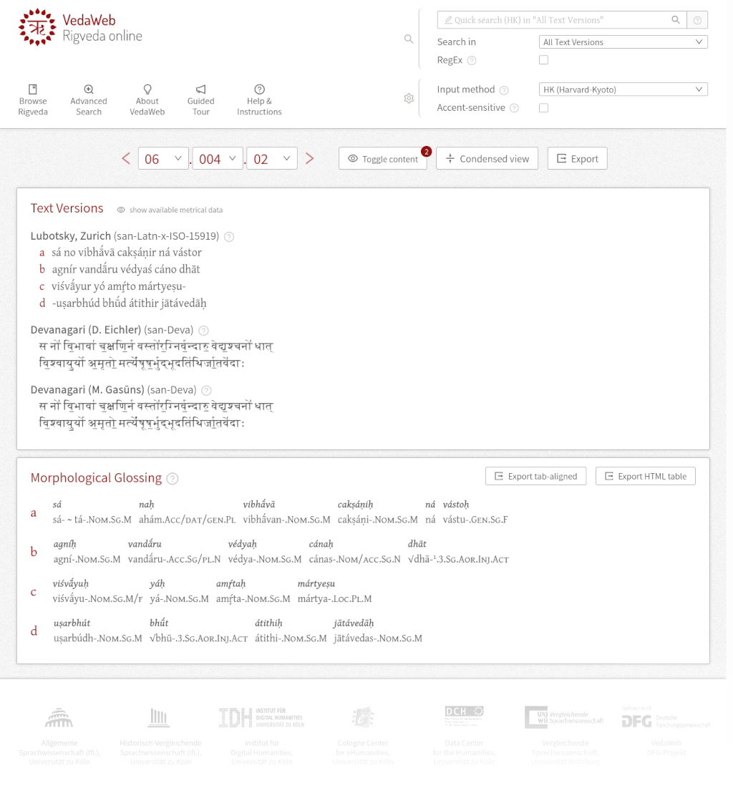
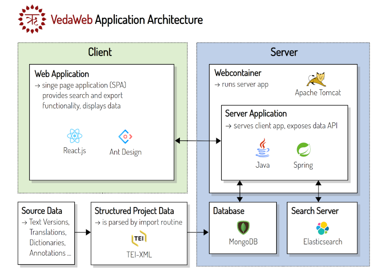

# VedaWeb <!-- omit in toc -->

[](https://github.com/VedaWebPlatform/vedaweb)
&nbsp;
[](http://vedaweb.uni-koeln.de/)


**This is the code repository for the VedaWeb application, which is being developed as part of the [VedaWeb project](https://vedaweb.uni-koeln.de/).**

This DFG-funded project provides a web-based, open-access platform in order to facilitate linguistic research on old indic texts. The text corpus is made available in a digitally accessible as well as morphologically and metrically annotated form, searchable for lexicographic and corpus-linguistic criteria. VedaWeb is part of the Cologne South Asian Languages and Texts (C-SALT).
The pilot text is the Rigveda, linked to the dictionaries available at Cologne Digital Sanskrit Dictionaries via the [C-SALT APIs for Sanskrit Dictionaries](https://cceh.github.io/c-salt_sanskrit_api/index.html). The morphological annotation of the Rig-Veda was carried out at the Universität Zürich (UZH) and made available for the project.




## Application Architecture




## Docker

If you want to try to run the application locally or on a server, you may use the provided Dockerfile (if you already have Elasticsearch and MongoDB services running) or the docker-compose file (to start containers for the services, too), see below.

### Docker compose

1. Download the latest `.tei` files from the [cceh/c-salt_vedaweb_tei](https://github.com/cceh/c-salt_vedaweb_tei/archive/master.tar.gz) repository into `resources/tei` and the external references data from [here](https://github.com/VedaWebPlatform/vedaweb-data-external/archive/master.tar.gz) into `resources/references`. You may use the bash script at `scripts/update-data.sh` to achieve all that automatically by calling `./scripts/update-data.sh resources/` from the projects root directory.
2. Run `docker compose up --build` for building and starting the needed containers in a preconfigured way. Use the `-d` flag to run detached containers.
3. The application will be served from `127.0.0.1:8081` (you can change the port in `.env`).

## State of Development
The VedaWeb Application is a product of the [VedaWeb research project](https://vedaweb.uni-koeln.de). It's current state covers the planned concepts of the first project phase. The platform is planned to be developed further into a collaborative research platform.


## API

### Some words in advance
The VedaWeb application exposes some API endpoints which are (at the time) limited to what the application itself needs to run. This might change in the future in that new, additional endpoints - which are actually *meant* to be used by other applications - might be added.


### Documentation of existing API endpoints

> :warning: The short documentation below is not complete, but explains the concepts of the exposed endpoints.
> For a complete overview of the endpoints, please see the OpenAPI schema at [vedaweb.uni-koeln.de/rigveda/openapi](https://vedaweb.uni-koeln.de/rigveda/openapi)

#### Direct Document Access via Index Numbers
The endpoints used for direct access to the documents managed by the application are accessible via simple `GET` requests of the following form:

```
vedaweb.uni-koeln.de/rigveda/api/document/index/0
```

In this example, `index` identifies a request for a document with a specified **index**. The example index `0` may be exchanged with any other number to retrieve the n-th document from the database.

There are currently 10522 documents (or *stanzas* in this case), with indices from `0` - `10551`. However, using numbers out of that range will work, too. It can even be quite practical: `-1` will map to the **last** document *from the end of the index range* (`10551`), while numbers greater than `10551` will work the opposite way (e.g. `10555` will map to index `3`).

The working range limit of this mechanism is `10551 * 2` for both positive and negative index numbers.

#### Direct Document Access via Rigveda Stanza Locations
Alternatively, documents (*stanzas*) can be requested directly via stanza location numbers. The corresponding endpoint (again, for `GET` requests) looks like this:

```
vedaweb.uni-koeln.de/rigveda/api/document/id/0100101
```

Here, `id` is used to identify a request via location number (*which is used as the document ID internally*, hence the designation). The parameter to the end can be any Rigveda stanza location number.

Allowed forms of location numbers are:

```
0100101
```
... for book no. `01` (2 digits), hymn no. `001` (3 digits), stanza no. `01` (2 digits), **OR**

```
1.1.1
```
... for book no. `1`, hymn no. `1`, stanza no. `1` - all separated by a `.` (standard notation) or **any non-digit delimiter that doesn't interfere with the URI scheme**.

#### Search API endpoints
The search API endpoints can be accessed via `POST` requests to the following endpoint:

```
vedaweb.uni-koeln.de/rigveda/api/search
```

Each request has to contain query data in JSON format. At the moment, there are two search modes that can be used, each requiring some special query properties (in addition to a handful of common ones):

##### Quick Search
The *quick search* is - as the name implies - a quick way to search certain full text data in a variety of ways. The flexibility of this search mode lies within the possibility to use some powerful search input syntax features like *wildcard searches*. Those features will be discussed below.

The general set of query properties for the *quick search* looks like this:

``` js
{
    "mode":    "quick",    // search mode (quick search, see above)
    "accents": false,      // enable/disable accent-sensitive search
    "field":   "version_", // field of data to search (see below)
    "input":   "ag*",      // search query input (see below for special syntax)
    "size":    50,         // (max.) number of search results to retrieve
    "from":    0           // index of the first search result to retrieve
}
```

"**field**" specifies the data field to search in. The *quick search* is capable of search VedaWeb's full-text fields, which are text versions and translations. If you only specify `version_` or `translation_`, the search will apply to **all** text versions or translations, respectively.
To search a certain version or translation, just append the respective name of the text (at the moment, this is the author's name in lowercase letters without any whitespaces or symbols), e.g. `version_lubotsky` or `translation_geldner`.

"**input**" is the data that is typed by the user when using the quick search tool in the application. It's possible to just search for a single word, multiple words or to make use of special syntax features like wildcard searches (e.g. `ag*` for the prefix `ag`), or logical operators (e.g. `tree AND house` or `tree OR house`). More details on this will follow in a more complete, official documentation when the application reaches a more mature state. Until then, you will find all the information you need in the help texts on the website.

#### Grammar Search
The *grammar search* is for searching VedaWeb's morphological annotations and other grammar data. The endpoint used is still `vedaweb.uni-koeln.de/rigveda/api/search`.

The following is a sample request body for the *grammar search*. Please see the web application for reference and comparison.

``` js
{
  "mode": "grammar",    // search mode ("grammar" for this kind of search)
  "accents": true,      // enable/disable accent-sensitive search
  "blocks": [           // search blocks list (each defining a term in a stanza)
    {
      "distance": 0,    // ignored by the application for now
      "form": "agním",  // search term for this block
      "lemma": false,   // search term is a lemma?
      "number": "SG",   // optional grammar property
      "required": true  // a block can be optional
    },
    {
      "case": "ACC",    // see pervious block
      "distance": 0,    // ...
      "form": "devá",
      "lemma": true,
      "required": false
    }
  ],
  "meta": {             // meta search filters (one of each must match!)...
    "hymnAddressee": [  // list of hymn addressees the stanzas have to match
      "Agni"
    ],
    "hymnGroup": [      // list of hymn grous the stanzas have to match
      "Hymns to Agni"
    ],
    "strata": [         // list of stanza strata the stanzas have to match
      "N"
    ]
  },
  "scopes": [           // list of search scope ranges to limit search to
    {
      "fromBook": 1,
      "fromHymn": 1,
      "toBook": 4,
      "toHymn": 2
    }
  ],
  "size": 50,           // (max.) number of search results to retrieve
  "from": 0             // index of the first search result to retrieve
}
```

#### Data Export Endpoints

##### TEI-XML of a single stanza
The following API endpoint returns the complete TEI-XML of a stanza:

```
vedaweb.uni-koeln.de/rigveda/api/export/doc/{docId}/xml
```
...where `docId` is the ID of the stanza to export. The form of the ID is the stanza number with trailing zeroes and without the dots. For book `2` (`02`), hymn `5` (`005`), stanza `1` (`01`), the ID would be `0200501`, so the full API call would be

```
vedaweb.uni-koeln.de/rigveda/api/export/doc/0200501/xml
```
